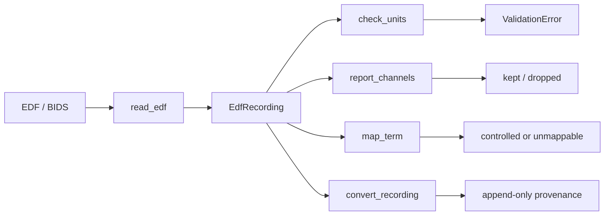

# eeg-harmonize

A canonical EEG record plus versioned adapters that normalize TUH, CHB-MIT,
Sleep-EDF, OpenNeuro BIDS-EEG, and TUAR into one schema so conversion
disagreements stop looking like dataset effects.

[](https://github.com/techiegoku2623/eeg-harmonize/actions/workflows/ci.yml)
[](pyproject.toml)
[](LICENSE)

## Status

| Phase | Deliverable | Status |
| --- | --- | --- |
| 0 | Research memo and harnesses | Phase 0 Merged |
| 1 | Architecture, schemas, data contracts | Phases 1–3 Merged |
| 2 | First vertical slice | Phases 1–3 Merged |
| 3 | Evaluation and demo | Phases 1–3 Merged |

Status values: Not started / In progress / In review / Merged.

## The problem this solves

Every public EEG corpus stores electrodes, sampling rates, references, and
event words differently. Labs rewrite the same conversion, and the rewrites
disagree in ways that do not raise an exception: volts versus microvolts,
T7 versus T3, an annotation that is one sample late. Those disagreements
survive into published cross-dataset numbers.

MNE already reads the files. BIDS already describes a layout. Neither one
is a tested, versioned adapter suite with a required provenance chain and a
validator that treats a 1e6 unit error as a hard failure. That is this repo.

This is infrastructure, not a diagnostic. Sample clips are designed. TUH
bytes are not committed; access needs an NEDC agreement (see `docs/DATA.md`).

## Walkthrough

`make demo` is the full walkthrough: inspect clean, convert clean, convert
bad-units (expected fail), convert odd-channels --report, then `make eval`.
No credentials. No TUH download. Under five minutes.

Recordings: `demo/01-inspect-and-convert.cast`,
`demo/02-validation-failures.cast`, `demo/03-fidelity-benchmark.cast`.

### Step 1 — inspect a clean 10-20 clip

```bash
make setup && eegh inspect data/sample/clean.edf
```

Actual stdout:

```
inspect  data/sample/clean.edf
montage:     10-20
sfreq:       256.0 Hz
reference:   unknown
channels:    8  Fp1, Fp2, C3, C4, O1, O2, T7, T8
duration:    30.000 s
ann. vocab:  seizure
present:     signal_array, channel_names, channel_units, sampling_rate_hz,
n_channels, duration_sec, montage_system, reference_scheme,
annotation_intervals, annotation_vocabulary, recording_datetime, filter_settings
missing:     channel_types, provenance, subject_id, subject_age, subject_sex,
channel_positions_3d, power_line_frequency, institution, task

Research infrastructure. Harmonized EEG is not a diagnostic and is not clinical
advice. Sample clips in this repository are designed, not patient records.
```

### Step 2 — convert with provenance

```bash
eegh convert --in data/sample/clean.edf
```

Actual stdout:

```
convert  data/sample/clean.edf
sfreq:       256.0 Hz
channels:    8 → 8
resampler:   resample_poly
dropped:     (none)
provenance:
  - read_edf:data/sample/clean.edf
  - check_units:pass
  - map_annotations:seizure->seizure
  - resample_poly:identity(256.0 Hz)

Research infrastructure. Harmonized EEG is not a diagnostic and is not clinical
advice. Sample clips in this repository are designed, not patient records.
```

Optional `--out` writes JSON or a small parquet plus `.meta.json`. The demo
does not require an output file.

### Step 3 — unit-scale rejection

```bash
eegh convert --in data/sample/bad-units.edf
```

Actual stdout (exit code 1):

```
unit_scale: unit_scale: header unit=V but peak |amplitude|=31.37; expected |V|
<< 0.01 for scalp EEG. Measured 1e6-scale mismatch.
Research infrastructure. Harmonized EEG is not a diagnostic and is not clinical
advice. Sample clips in this repository are designed, not patient records.
```

### Step 4 — dropped channels, reported

```bash
eegh convert --in data/sample/odd-channels.edf --report
```

Actual stdout:

```
convert  data/sample/odd-channels.edf
sfreq:       256.0 Hz
channels:    10 → 8
resampler:   resample_poly
dropped:     CB1, CB2  (no 10-20 equivalent; never renamed)
unmappable:  sleepy-wiggle
provenance:
  - read_edf:data/sample/odd-channels.edf
  - check_units:pass
  - drop_noncanonical:CB1,CB2
  - map_annotations:seizure->seizure,sleepy-wiggle->unmappable
  - resample_poly:identity(256.0 Hz)

Research infrastructure. Harmonized EEG is not a diagnostic and is not clinical
advice. Sample clips in this repository are designed, not patient records.
```

### Step 5 — measured fidelity

```bash
make eval
```

Regenerates `docs/EVALUATION.md` from the Phase 0 harnesses plus the Phase 3
designed-clip convert table. Default resampler remains `resample_poly`. TUH
is not downloaded; the transfer matrix is unmeasured.

## Layout

1. `docs/phase-0/research-memo.md` — required fields, default resampler, vocab
2. `data/sample/README.md` — why each clip exists
3. `src/eeg_harmonize/schema.py` — canonical field list
4. `src/eeg_harmonize/edf.py` — the committed-clip codec
5. `src/eeg_harmonize/validate.py` — unit-scale and channel-drop checks
6. `src/eeg_harmonize/inspect.py` / `convert.py` — Phase 2 vertical slice
7. `research/phase0/` — the measurements
8. `research/phase3/` — designed-clip convert / unit_scale eval

## Results

Regenerated by `make eval`. Baseline column is mandatory.

<!-- EVAL_TABLE_BEGIN -->

| Measurement | Result | Baseline |
| --- | --- | --- |
| Default resampler | resample_poly | naive decimate |
| Required canonical fields | 16 | all 21 required |
| Unified flat annotation enum | no (mean Jaccard 0.013) | assume yes |
| Designed-clip convert | ok; unit_scale rejects bad-units | silent unit/channel errors |
| Cross-dataset transfer matrix | not run (TUH not downloaded) | unharmonized MNE |

<!-- EVAL_TABLE_END -->

## 🏗️ Architecture & Event Topology



`EdfRecording` is the Phase 0 data object. Convert adds an append-only
provenance chain (`read_edf` → `check_units` → drop / map / `resample_poly`).

## ⚖️ Architecture Trade-offs & Pragmatic Decisions

| Chosen | Given up | What would change the answer |
| --- | --- | --- |
| Designed EDF clips instead of TUH excerpts | Real corpus bytes in the demo | TUH DUA plus a legal review that redistribution of 30 s clips is allowed (it is not, today) |
| Spec inventory for schema coverage | Header scan of every file | DUA + disk |
| scipy resamplers only | MNE / torchaudio | A fidelity gap large enough to matter on the same harness |
| Small controlled vocab + unmappable | One required enum | Mean Jaccard ≥ 0.25, which the harness rejects |
| Minimal EDF codec | pyedflib / MNE I/O in Phase 0 | Need for BDF 24-bit or discontinued EDF+ |

## 🛡️ Edge Cases & Failure Modes

- Header unit `V` with µV-scale samples: hard fail (`unit_scale`).
- CB1/CB2/EKG: dropped, never aliased to O1/A1.
- `sleepy-wiggle`: unmappable, not nearest-term.
- Off-by-one annotation: stored as `10+1/256` s; alignment tests compare to 10.0.
- TUH `EEG FP1-REF` prefixes: stripped; unknown remainder is not renamed.
- This codec does not read BDF or EDF+D.

## Limitations

Not a diagnostic. Not a TUH redistributor. Not a finished adapter suite.
Designed clips convert with a provenance chain. TUH bytes are not present.
The cross-dataset transfer matrix is unmeasured.

## License and citation

MIT. Cite the corpus papers when you use those data. Cite this repository
for the schema and adapters. TUH access is a separate agreement.
