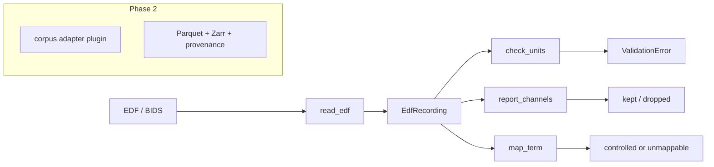

# eeg-harmonize

A canonical EEG record plus versioned adapters that normalize TUH, CHB-MIT,
Sleep-EDF, OpenNeuro BIDS-EEG, and TUAR into one schema so conversion
disagreements stop looking like dataset effects.

[](https://github.com/techiegoku2623/eeg-harmonize/actions/workflows/ci.yml)
[](pyproject.toml)
[](LICENSE)

## Status

| Phase | Deliverable | Status |
| --- | --- | --- |
| 0 | Research memo and harnesses | In review — docs/phase-0/research-memo.md |
| 1 | Architecture, schemas, data contracts | Not started |
| 2 | First vertical slice | Not started |
| 3 | Evaluation and demo | Not started |

Status values: Not started / In progress / In review / Merged.

## The problem this solves

Every public EEG corpus stores electrodes, sampling rates, references, and
event words differently. Labs rewrite the same conversion, and the rewrites
disagree in ways that do not raise an exception: volts versus microvolts,
T7 versus T3, an annotation that is one sample late. Those disagreements
survive into published cross-dataset numbers.

MNE already reads the files. BIDS already describes a layout. Neither one
is a tested, versioned adapter suite with a required provenance chain and a
validator that treats a 1e6 unit error as a hard failure. That is this repo.

This is infrastructure, not a diagnostic. Sample clips are designed. TUH
bytes are not committed; access needs an NEDC agreement (see `docs/DATA.md`).

## Walkthrough

Phase 0 ships the designed clips and the measurements. `eegh inspect` and
`eegh convert` are Phase 2.

### Step 1 — designed clips

```bash
make setup && make demo
```

`make demo` prints the five committed EDFs. Actual stdout:

```
eeg-harmonize designed sample clips

clean.edf
  path:     standard 10-20 conversion
  expected: inspect + convert succeed; no channel drops

bad-units.edf
  path:     µV data, header claims V
  expected: unit_scale validator rejects; non-zero exit

odd-channels.edf
  path:     CB1/CB2 have no 10-20 equivalent
  expected: drop and log; never rename

unmapped-annots.edf
  path:     terms outside the controlled set
  expected: unmappable bucket, reported

offset-annots.edf
  path:     off-by-one sample annotation
  expected: alignment test fails on 1/256 s offset

Research infrastructure. Harmonized EEG is not a diagnostic and is not clinical
advice. Sample clips in this repository are designed, not patient records.
```

They are not the first 100 rows of any corpus.

Recordings `demo/01-inspect-and-convert.cast` land in Phase 3.

### Step 2 — convert with provenance (Phase 2)

```bash
eegh convert --in data/sample/clean.edf --out /tmp/out.parquet
```

Reserved. Any harmonized file has to trace to the source operation chain.

### Step 3 — unit-scale rejection (Phase 2)

```bash
eegh convert --in data/sample/bad-units.edf
```

Reserved. `unit_scale` already exists as a Phase 0 check and is tested:
header `V` plus peak ≫ 0.01 is a hard fail. That is the failure mode this
library exists to prevent.

### Step 4 — dropped channels, reported (Phase 2)

```bash
eegh convert --in data/sample/odd-channels.edf --report
```

Reserved. CB1 and CB2 have no 10-20 equivalent. Drop and log, never rename.

### Step 5 — measured fidelity

```bash
make eval
```

Runs now. Regenerates `docs/EVALUATION.md` from the three harnesses,
including the resampler table and the annotation overlap matrix.

## Layout

1. `docs/phase-0/research-memo.md` — required fields, default resampler, vocab
2. `data/sample/README.md` — why each clip exists
3. `src/eeg_harmonize/schema.py` — canonical field list
4. `src/eeg_harmonize/edf.py` — the committed-clip codec
5. `src/eeg_harmonize/validate.py` — unit-scale and channel-drop checks
6. `research/phase0/` — the measurements

## Results

Regenerated by `make eval`. Baseline column is mandatory.

<!-- EVAL_TABLE_BEGIN -->

| Measurement | Result | Baseline |
| --- | --- | --- |
| Default resampler | resample_poly | naive decimate |
| Required canonical fields | 16 | all 21 required |
| Unified flat annotation enum | no (mean Jaccard 0.013) | assume yes |
| Cross-dataset transfer matrix | Phase 3 | unharmonized MNE |

<!-- EVAL_TABLE_END -->

## 🏗️ Architecture & Event Topology



`EdfRecording` is the Phase 0 data object. The Phase 2 canonical record adds
provenance operations as an append-only list.

## ⚖️ Architecture Trade-offs & Pragmatic Decisions

| Chosen | Given up | What would change the answer |
| --- | --- | --- |
| Designed EDF clips instead of TUH excerpts | Real corpus bytes in the demo | TUH DUA plus a legal review that redistribution of 30 s clips is allowed (it is not, today) |
| Spec inventory for schema coverage | Header scan of every file | DUA + disk |
| scipy resamplers only | MNE / torchaudio | A fidelity gap large enough to matter on the same harness |
| Small controlled vocab + unmappable | One required enum | Mean Jaccard ≥ 0.25, which the harness rejects |
| Minimal EDF codec | pyedflib / MNE I/O in Phase 0 | Need for BDF 24-bit or discontinued EDF+ |

## 🛡️ Edge Cases & Failure Modes

- Header unit `V` with µV-scale samples: hard fail (`unit_scale`).
- CB1/CB2/EKG: dropped, never aliased to O1/A1.
- `sleepy-wiggle`: unmappable, not nearest-term.
- Off-by-one annotation: stored as `10+1/256` s; alignment tests compare to 10.0.
- TUH `EEG FP1-REF` prefixes: stripped; unknown remainder is not renamed.
- This codec does not read BDF or EDF+D.

## Limitations

Not a diagnostic. Not a TUH redistributor. Not a finished adapter suite.
Phase 0 does not convert to Parquet, does not train the transfer model, and
does not record asciinema.

## License and citation

MIT. Cite the corpus papers when you use those data. Cite this repository
for the schema and adapters. TUH access is a separate agreement.
